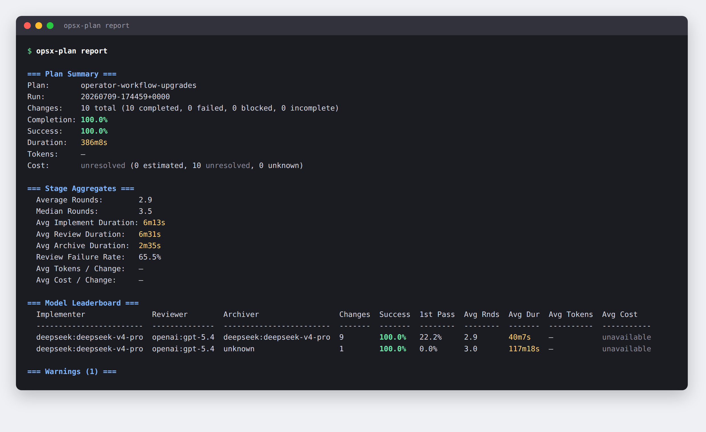
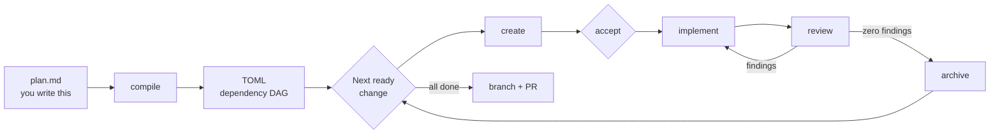
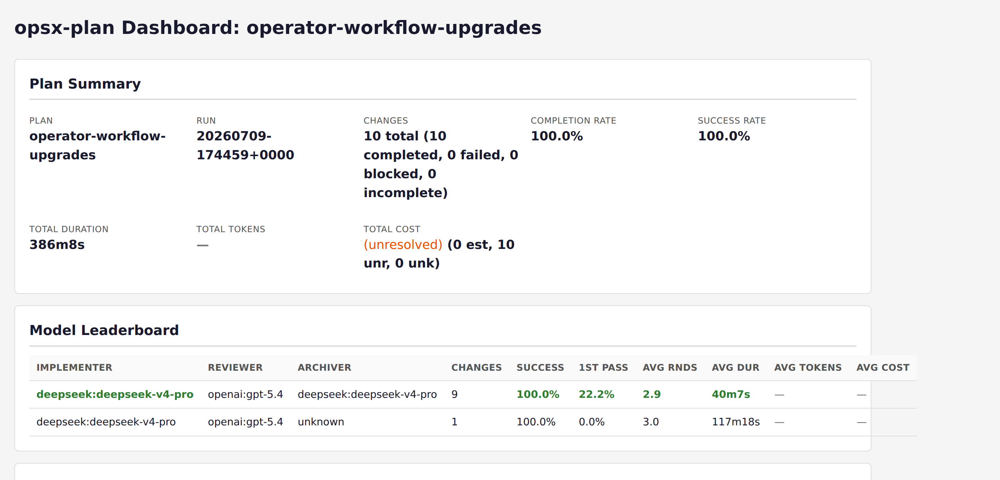

# opsx-controller

**Write the plan in markdown. Drive it to done — implement, review, re-review
until clean, archive — unattended.**

Driving a change through a coding agent usually means babysitting it: prompt
implement, then review, then re-prompt implement when review finds something,
then remember to archive once it's clean. Repeat per change, while holding the
dependency order in your head.

`opsx-controller` takes over at that line. You write a plan in markdown — in the
tool of your choice, or by hand. `opsx-plan` compiles it into a dependency
graph, authors each change, and loops implement → review until a review comes
back with zero findings, then archives it — verifying against ground truth at
every step and failing closed when anything is ambiguous. It works the same way
whether the underlying agent is Claude Code, OpenCode, or Codex CLI.

```bash
$EDITOR openspec/plans/my-plan.md                                          # you write this
opsx-plan compile openspec/plans/my-plan.md                                # markdown -> DAG (default output: openspec/plans/my-plan.toml)
opsx-plan run --dry-run                                                    # inspect the order and gates
opsx-plan run                                                              # drive it
```

## What you write, and what the loop does

You keep the vision. The loop takes the tedium.

| Stage | Who | What happens |
|---|---|---|
| the plan | **you** | A markdown document: what should exist, why, in what phases, and what "done" means. Authored anywhere — a chat with a model, an editor, a napkin. |
| `compile` | opsx-plan | Turns that markdown into a TOML dependency graph, and activates it. |
| `create` | worker | Authors each OpenSpec change — proposal, tasks, spec deltas — then **stops and waits for your `opsx-plan accept`** before anything is driven. |
| `implement` | worker | Applies one bounded change. |
| `review` | worker | Any critical, warning, *or* note finding sends the work back to `implement`. |
| `archive` | worker | Only after a fresh zero-finding review, and only once the change directory has actually moved into `openspec/changes/archive/`. |

**You never hand-author an OpenSpec change.** OpenSpec is the representation the
loop works inside, not a format you write. It needs to be initialized in the
repo once (see Quick start); after that you write markdown plans.

The run below drove 10 changes to completion in one session, unattended:



## Why it exists

- **Unattended, not unsupervised.** The loop runs without you, but every phase
  transition is verified against the repository, not against what the agent
  claimed it did.
- **The review gate is strict.** Any critical, warning, *or* note finding is
  blocking. In the run above, review sent work back on 65.5% of review stages
  — that is the gate doing its job, and it is why 10/10 changes archived clean.
- **Fails closed.** Ambiguous archive scope, unparseable phase output, or a
  change that stops making progress stops the run instead of guessing.
- **Resumable.** State is durable per change. Interrupt a run and re-run it;
  it picks up where it left off.
- **Client-portable.** The same contract runs on three coding agents, so
  switching clients does not mean rewriting the workflow.
- **Measurable.** Every stage emits telemetry, so you can compare model
  combinations on rounds, duration, first-pass rate, and cost.

## How it works



The orchestrator is deliberately a deterministic script, not an agent. All LLM
judgment stays inside the implement, review, and archive workers. The
orchestrator only does ordering, dispatch, verification, retry policy, and
durable bookkeeping.

`create` is verified against the repository the same way every other stage is:
the change is not considered authored until its artifacts exist on disk. By
default (`review_created = true`) the run pauses there for you to read what the
system decided your plan meant, and continues on `opsx-plan accept`.

Underneath, the per-change controller contract is client-neutral. `opsx-plan`
sequences the DAG; the controller handles exactly one change at a time:

- drives exactly one OpenSpec change per controller invocation
- persists durable per-change state
- loops implement → review → implement until review is clean
- treats any critical, warning, or note finding as blocking
- auto-archives only after a fresh zero-finding review
- fails closed when archive scope or phase output is ambiguous

## Reports and dashboards

Every stage of every run is recorded. `opsx-plan report` prints deterministic
tables (add `--json` for machine-readable output); `opsx-plan dashboard`
generates a self-contained static HTML file with no external assets.

```bash
opsx-plan report                      # tables, as pictured above
opsx-plan report --json               # same data, machine-readable
opsx-plan dashboard                   # -> .opsx-plan/dashboards/<plan>.html
```



`report` filters with `--change`, `--run-id`, `--stage`, and `--model`;
`dashboard` filters with `--change` and `--run-id`.
The model leaderboard is the point: it scores implementer/reviewer/archiver
combinations against each other on the same plan, which is how you decide what
to run next time. See the [Model Efficiency
Workflow](core/model-efficiency-workflow.md) for that benchmarking loop.

> The `—` and `unresolved` entries above are honest output, not placeholders:
> that run's workers reported no token usage (`unresolved_reason: "usage
> unavailable"`), so cost could not be estimated. Token capture is what the
> later telemetry work added; runs with usage data populate these columns.

## Quick start

Requires Python 3.11+ (the orchestrator uses `tomllib`), git, the
[OpenSpec](https://github.com/Fission-AI/OpenSpec) CLI >= 1.7, and a supported
coding client. There is nothing to pip install — the orchestrator is
stdlib-only.

> **OpenCode and Claude Code can compile plans; all three adapters install the
> orchestrator to `~/.local/bin/`.**  `opsx-plan compile` supports `--adapter
> opencode` (the default) and `--adapter claude-code`.  Every adapter's global
> installer deploys `opsx-plan` and `opsx-run` to `~/.local/bin/` via a shared
> installer helper.  `opsx-run` is supported on OpenCode and Claude Code only;
> Codex CLI has no default stage invokes and cannot drive
> single-change `opsx-run` without a hand-written plan manifest.
> See [docs/adapters.md](docs/adapters.md#choosing-an-adapter).

**1. Clone and configure models.**

```bash
git clone https://github.com/brianmoney/opsx-controller.git
cd opsx-controller
python3 orchestrator/opsx-plan.py models init   # seeds ~/.config/opsx-controller/models.toml
$EDITOR ~/.config/opsx-controller/models.toml
```

Roles are `controller`, `implementer`, `reviewer`, and `archiver`, resolved per
adapter. Installers and plan runs fail closed with guidance if no model
resolves.

**2. Install the adapter for your coding client.**

```bash
bash adapters/opencode/install.sh --global      # or claude-code, or codex-cli
```

Use `--project /path/to/repo` instead of `--global` to install into a single
project. Install the adapter for whichever coding client you plan to use (or
more than one — they coexist). Every adapter's global installer deploys
`opsx-plan` and `opsx-run` to `~/.local/bin/`.

**3. Initialize OpenSpec in your project, once.**

```bash
cd /path/to/your/repo
openspec init          # only if the repo has no openspec/ directory yet
```

This is the one time OpenSpec is something you set up. From here you write
markdown plans; the loop authors the changes.

**4. Write a plan, compile it, and run.**

```bash
$EDITOR openspec/plans/my-plan.md
opsx-plan compile openspec/plans/my-plan.md
opsx-plan doctor                      # preflight checks
opsx-plan run --dry-run               # review the DAG and gates first
opsx-plan run
```

`compile` activates the plan it just wrote, so there is no separate `opsx-plan
use` step — that command is for switching between existing manifests. For
worked examples of what a plan document looks like, see the real ones in
[`openspec/plans/archived/`](openspec/plans/archived), each paired with the
TOML it compiled to.

Always review the DAG with `--dry-run` before an unattended run. For a single
already-authored change, skip the plan manifest entirely with
`opsx-run <change-id>`.

## Documentation

| Guide | What it covers |
|---|---|
| [Operator Workflow](docs/opsx-plan-operator-workflow.md) | The full operator loop: activation, `doctor`, budgets, manual gates, logs, notifications, branch/PR delivery |
| [Plan-Authoring Reference](core/plan-authoring.md) | How to write compilable markdown implementation plans for `opsx-plan compile` |
| [Adapter Reference](docs/adapters.md) | Per-client install and packaging for OpenCode, Claude Code, and Codex CLI |
| [Orchestrator Reference](orchestrator/README.md) | Manifest schema, execution model, retry policy, adapter invocation |
| [Model Efficiency Workflow](core/model-efficiency-workflow.md) | Benchmarking model choices with telemetry, reports, and dashboards |
| [Controller Contract](core/controller-contract.md) | Lifecycle, phase order, stop conditions |
| [State Schema](core/state-schema.md) | Durable state expectations and resume behavior |
| [Phase Protocol](core/phase-protocol.md) | Input/output contracts for implement, review, archive |

## Layout

- `core/`: client-neutral controller contract, state schema, and phase protocol
- `orchestrator/`: `opsx-plan` deterministic plan-level orchestrator
- `docs/`: operator workflow, adapter reference, and benchmarking guides
- `adapters/`: per-client commands, agents, installers, and templates for
  `opencode`, `claude-code`, and `codex-cli`
- `plugins/opsx-controller/`: Claude Code plugin package for `--plugin-dir` and
  marketplace packaging
- `skills/`: Vercel `npx skill` packages — `opsx-controller` (discovery and
  guided use), `opsx-plan-manifest` (authoring/auditing plan TOMLs), and
  `opsx-plan-ops` (operating, triaging, and recovering `opsx-plan` runs)

## Running the tests

Two suites, both dependency-free:

```bash
python3 -m unittest discover -t . -s tests
node tests/opencode/test-opsx-usage-emitter.js
```

Both run in CI on every push and pull request. See
[CONTRIBUTING.md](CONTRIBUTING.md) for how changes to this repo are expected to
flow, and [SECURITY.md](SECURITY.md) for what permissions the workers run with.

## License

MIT — see [LICENSE](LICENSE).
