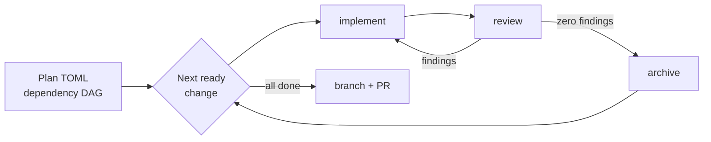

# opsx-controller

**Drive a whole plan of OpenSpec changes through implement → review → archive,
unattended.**

Driving an OpenSpec change through a coding agent usually means babysitting it:
prompt implement, then review, then re-prompt implement when review finds
something, then remember to archive once it's clean. Repeat per change.

`opsx-controller` turns that into one command. `opsx-plan run` walks a
dependency graph of changes and, for each one, loops implement → review until a
review comes back with zero findings, then archives it — verifying against
ground truth at every step and failing closed when anything is ambiguous. It
works the same way whether the underlying agent is Claude Code, OpenCode, or
Codex CLI.

```bash
opsx-plan run                 # drive the whole plan
opsx-run add-user-avatars     # or drive one already-authored change
```

The run below drove 10 changes to completion in one session, unattended:


## Why it exists

- **Unattended, not unsupervised.** The loop runs without you, but every phase
  transition is verified against the repository, not against what the agent
  claimed it did.
- **The review gate is strict.** Any critical, warning, *or* note finding is
  blocking. In the run above, review sent work back on 65.5% of review stages
  — that is the gate doing its job, and it is why 10/10 changes archived clean.
- **Fails closed.** Ambiguous archive scope, unparseable phase output, or a
  change that stops making progress stops the run instead of guessing.
- **Resumable.** State is durable per change. Interrupt a run and re-run it;
  it picks up where it left off.
- **Client-portable.** The same contract runs on three coding agents, so
  switching clients does not mean rewriting the workflow.
- **Measurable.** Every stage emits telemetry, so you can compare model
  combinations on rounds, duration, first-pass rate, and cost.

## How it works



The orchestrator is deliberately a deterministic script, not an agent. All LLM
judgment stays inside the implement, review, and archive workers. The
orchestrator only does ordering, dispatch, verification, retry policy, and
durable bookkeeping.

Underneath, the per-change controller contract is client-neutral. `opsx-plan`
sequences the DAG; the controller handles exactly one change at a time:

- drives exactly one OpenSpec change per controller invocation
- persists durable per-change state
- loops implement → review → implement until review is clean
- treats any critical, warning, or note finding as blocking
- auto-archives only after a fresh zero-finding review
- fails closed when archive scope or phase output is ambiguous

## Reports and dashboards

Every stage of every run is recorded. `opsx-plan report` prints deterministic
tables (add `--json` for machine-readable output); `opsx-plan dashboard`
generates a self-contained static HTML file with no external assets.

```bash
opsx-plan report                      # tables, as pictured above
opsx-plan report --json               # same data, machine-readable
opsx-plan dashboard                   # -> .opsx-plan/dashboards/<plan>.html
```


`report` filters with `--change`, `--run-id`, `--stage`, and `--model`;
`dashboard` filters with `--change` and `--run-id`.
The model leaderboard is the point: it scores implementer/reviewer/archiver
combinations against each other on the same plan, which is how you decide what
to run next time. See the [Model Efficiency
Workflow](core/model-efficiency-workflow.md) for that benchmarking loop.

> The `—` and `unresolved` entries above are honest output, not placeholders:
> that run's workers reported no token usage (`unresolved_reason: "usage
> unavailable"`), so cost could not be estimated. Token capture is what the
> later telemetry work added; runs with usage data populate these columns.

## Quick start

Requires Python 3.11+ (the orchestrator uses `tomllib`) and git. There is
nothing to pip install — the orchestrator is stdlib-only.

**1. Clone and configure models.**

```bash
git clone https://github.com/brianmoney/opsx-controller.git
cd opsx-controller
python3 orchestrator/opsx-plan.py models init   # seeds ~/.config/opsx-controller/models.toml
$EDITOR ~/.config/opsx-controller/models.toml
```

Roles are `controller`, `implementer`, `reviewer`, and `archiver`, resolved per
adapter. Installers and plan runs fail closed with guidance if no model
resolves.

**2. Install the adapter for your coding client.**

```bash
bash adapters/opencode/install.sh --global      # or claude-code, or codex-cli
```

Use `--project /path/to/repo` instead of `--global` to install into a single
project.

> **Note:** the OpenCode installer is the one that installs the orchestrator
> executables (`opsx-plan` and `opsx-run`) to `~/.local/bin`. If you install
> only the Claude Code or Codex CLI adapter, the loop works the same, but
> invoke the orchestrator from this checkout as `python3
> orchestrator/opsx-plan.py ...` wherever these docs say `opsx-plan ...`.
> Compiling a markdown plan to TOML also requires OpenCode. See
> [docs/adapters.md](docs/adapters.md#choosing-an-adapter).

**3. Point it at a project that already uses OpenSpec, and run.**

```bash
opsx-plan doctor                      # preflight checks
opsx-plan use openspec/plans/my-plan.toml
opsx-plan run --dry-run               # review the DAG and gates first
opsx-plan run
```

Always review the DAG with `--dry-run` before an unattended run. For a single
already-authored change, skip the plan manifest entirely with
`opsx-run <change-id>`.

## Documentation

| Guide | What it covers |
|---|---|
| [Operator Workflow](docs/opsx-plan-operator-workflow.md) | The full operator loop: activation, `doctor`, budgets, manual gates, logs, notifications, branch/PR delivery |
| [Adapter Reference](docs/adapters.md) | Per-client install and packaging for OpenCode, Claude Code, and Codex CLI |
| [Orchestrator Reference](orchestrator/README.md) | Manifest schema, execution model, retry policy, adapter invocation |
| [Model Efficiency Workflow](core/model-efficiency-workflow.md) | Benchmarking model choices with telemetry, reports, and dashboards |
| [Controller Contract](core/controller-contract.md) | Lifecycle, phase order, stop conditions |
| [State Schema](core/state-schema.md) | Durable state expectations and resume behavior |
| [Phase Protocol](core/phase-protocol.md) | Input/output contracts for implement, review, archive |

## Layout

- `core/`: client-neutral controller contract, state schema, and phase protocol
- `orchestrator/`: `opsx-plan` deterministic plan-level orchestrator
- `docs/`: operator workflow, adapter reference, and benchmarking guides
- `adapters/`: per-client commands, agents, installers, and templates for
  `opencode`, `claude-code`, and `codex-cli`
- `plugins/opsx-controller/`: Claude Code plugin package for `--plugin-dir` and
  marketplace packaging
- `skills/opsx-controller/`: Vercel `npx skill` package for discovery and
  guided use

## Running the tests

Two suites, both dependency-free:

```bash
python3 -m unittest discover -t . -s tests
node tests/opencode/test-opsx-usage-emitter.js
```

Both run in CI on every push and pull request. See
[CONTRIBUTING.md](CONTRIBUTING.md) for how changes to this repo are expected to
flow, and [SECURITY.md](SECURITY.md) for what permissions the workers run with.

## License

MIT — see [LICENSE](LICENSE).
